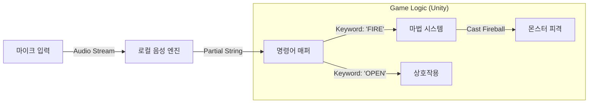

# [기술 명세서 Rev.2] Spell Caster: Real-time Voice Architecture

**작성자:** Jules (Lead Architect)
**날짜:** 2024-05-22

---

## 1. 아키텍처 개요 (Overview)

이전의 '문장 분석' 로직을 폐기하고, **'키워드 매칭(Keyword Spotting)'** 기반의 이벤트 드리븐 아키텍처로 변경합니다.
LLM이나 복잡한 NLP 없이, 오직 **String Comparison**만으로 게임을 제어하여 즉각적인 반응성을 확보합니다.

### 1.1. Data Flow



---

## 2. 핵심 기술: Real-time KWS (Keyword Spotting)

### 2.1. Unity 내 구현 전략
1.  **Android:** `SpeechRecognizer`의 `onPartialResults` 콜백 사용.
    *   유저가 말을 끝내기 전(Silence 감지 전)에 중간 결과를 실시간으로 받아와 매칭.
    *   "F.. Fi... Fire" -> "Fire" 감지 즉시 발동.
2.  **iOS:** `SFSpeechRecognizer`의 `shouldReportPartialResults = true`.
3.  **PC/Editor:** `Whisper.cpp` (Stream 모드) 또는 Windows 10/11 내장 DictationRecognizer.

### 2.2. Command Mapping Algorithm (Trie 구조 활용 가능)
단순한 `String.Contains` 대신, 미리 등록된 '마법 사전(Spell Dictionary)'과 대조합니다.

*   **Dictionary:**
    *   "FIRE" -> Skill_ID: 101
    *   "FLAME" -> Skill_ID: 101
    *   "WATER" -> Skill_ID: 102
    *   "AQUA" -> Skill_ID: 102

---

## 3. 데이터 구조 (Data Structure)

### 3.1. SpellData (마법 데이터)
```csharp
[Serializable]
public class SpellData {
    public string keyword;      // 발동 키워드 (대문자)
    public SpellType type;      // Attack, Defense, Utility
    public GameObject prefab;   // 발사체 프리팹
    public float cooldown;
}
```

---

## 4. 최적화 및 예외 처리

### 4.1. 오인식 방지 (Confidence Threshold)
*   주변 소음으로 인한 오발동을 막기 위해 음성 엔진이 제공하는 `Confidence Score`가 0.7 이상일 때만 발동.

### 4.2. 발음 관용 (Fuzzy Matching)
*   아이들의 발음이 부정확할 수 있으므로, Levenshtein Distance(편집 거리) 알고리즘을 사용하여 유사 발음도 허용.
    *   "Fia" (Fire) -> Distance 2 이내 -> 인정.

---

**결론:** 기술적 난이도는 낮추고, 사용자 경험(UX)은 극대화했습니다.
